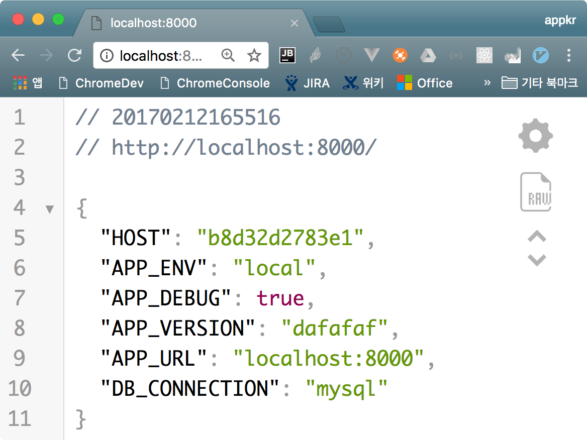

## ECS Deploy Demo

AWS ECS(EC2 Container Service)와 ECR(Container Registry) 서비스를 이용해서 라라벨 서비스를 배포하기위한 데모 프로젝트입니다.

ECS는 도커 기반의 서비스 인프라이고, ECR은 도커 허브와 같은 사설 이미지 저장소입니다. 이 서비스를 이용하면 도커로 서비스 환경을 구성할 때 어려운 문제점들을 쉽게 해결할 수 있습니다. ECS 사용에 따른 별도의 요금은 없고, EC2 인스턴스와 같은 요금이 적용된다고 합니다.

> 서울 지역은 오픈 전입니다. 빨리 오픈해주세요.

더 자세한 내용은 [블로그 포스트](http://blog.appkr.kr/work-n-play/deploy-with-ecs/)를 참고해주세요.

## 1. 프로젝트 설치

프로젝트를 복제합니다.

```bash
~ $ git clone git@github.com:appkr/deploy-laravel-with-ecs-and-ecr.git

# 깃허브에 SSH 키를 등록하지 않았다면...
~ $ git clone https://github.com/appkr/deploy-laravel-with-ecs-and-ecr.git
```

이 프로젝트가 의존하는 라이브러리를 설치하고, 프로젝트 설정 파일을 생성합니다.

```bash
# composer가 없다면 getcomposer.org를 참고해주세요.

$ cd fcm-scratchpad
~/deploy-laravel-with-ecs-and-ecr $ composer install
~/deploy-laravel-with-ecs-and-ecr $ cp .env.example .env
~/deploy-laravel-with-ecs-and-ecr $ php artisan key:generate
```

## 2. 도커라이즈

### 2.1. 도커 엔진 설치

아래 링크를 방문해서 각자의 운영체제에 맞는 Docker 패키지를 설치합니다.

> https://www.docker.com/products/docker

잘 설치되었나 확인합니다.

```bash
~/any $ docker --version
# Docker version 1.13.0, build 49bf474
```

위 링크를 방문하지 않고도 더 편하게 설치하는 방법은 다음과 같습니다.

#### 2.1.1. OS X

```bash
~/any $ brew cask install docker --appdir=/Applications
```

#### 2.1.2. Ubuntu Linux

```bash
~/any $ sudo apt update && sudo apt install docker
```

### 2.2. 이미지 빌드

프로젝트에 포함된 `Dockerfile`을 이용해서 도커 이미지를 빌드합니다. 이 이미지는 애플리케이션 구동을 위한 인프라(Linux + Apache + PHP) 뿐만아니라, 애플리케이션까지도 포함하고 있어, 완전 독립적인 한 대의 서버라고 생각해도 좋습니다.

이미지 이름은 `myshop`이라 하겠습니다.

```bash
~/deploy-laravel-with-ecs-and-ecr $ docker build --tag appkr/myshop .

~/any $ docker images
# REPOSITORY      TAG       IMAGE ID        CREATED             SIZE
# appkr/myshop    latest    126f36ac9412    About an hour ago   549 MB
```

### 2.3. 컨테이너 실행

컨테이너 이름도 `myshop`이라 하겠습니다.

```bash
~/any $ docker run --name myshop --detach --publish 8000:80 appkr/myshop:latest

~/any $ docker ps
CONTAINER ID    IMAGE                 COMMAND                  CREATED           STATUS           PORTS                  NAMES
b8d32d2783e1    appkr/myshop:latest   "docker-php-entryp..."   16 seconds ago    Up 15 seconds    0.0.0.0:8000->80/tcp   myshop
```

`http://localhost:8000`을 열어 작동을 확인합니다.



> 포트 바인딩과 컨테이너 이름만 바꾸어 `docker run` 명령을 여러 번 실행하면 10개든 100개든 서버를 뚝딱 뚝딱 찍어 낼 수 있습니다.

### 2.4. 컨테이너 삭제

실행 중인 컨테이너를 삭제해도 이미지는 그대로 남아 있으므로, 언제든 컨테이너를 다시 띄울 수 있습니다.

```bash
~/any $ docker stop myshop && docker rm myshop
# myshop
# myshop
```

이미지를 완전히 삭제하려면 다음 명령을 이용합니다.

```bash
~/any $ docker rmi appkr/myshop:latest
# appkr/myshop:latest
```
